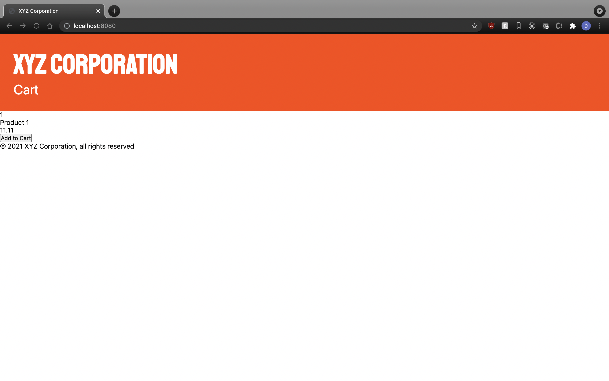

# xyz.com exercise

CSS Exercise A

-   apply your own creative flare, colors, fonts, design etc.

1. make and link a CSS file called 'main.css'

2. find and apply font to company name

3. apply appropriate spacing

4. notice the links and copy

## finished product should look roughly like this

## setup

`yarn install`

## develop the project

`yarn test` or `yarn test-watch`
